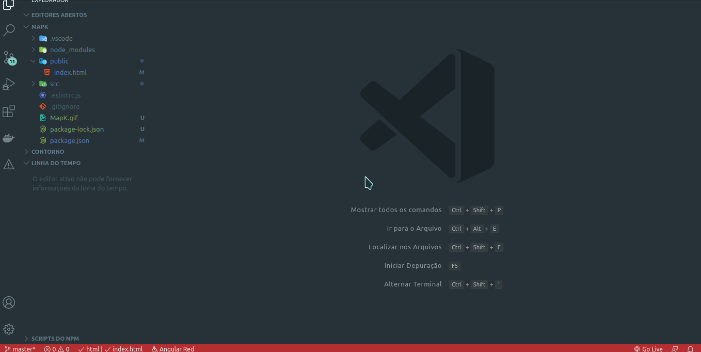

 
# Mapa De Karnaugh

Essa aplicação web tem como objetivo a simplificação de expressões booleanas por meio do método mapa de **Karnaugh**.

OBS: O numero máximo de variáveis aceitas e 5, em próximas atualizações esse numero deve aumentar.

## Começando
Para executar o projeto, será necessário instalar os seguintes programas:

- Editor Texto ( É recomendado o Visual Studio Code)
- Servidor HTTP Local ( ou a extensão Live Server do Visual Studio Code)

## Desenvolvimento
 Para iniciar o desenvolvimento, é necessário clonar o projeto do GitHub para o diretório de sua preferência:
>cd "dir"  
git clone https://github.com/levi5/Karnaugh-map

## Construção
Para execução do projeto basta executar o comando abaixo e abrir o arquivo **index.html**:
> yarn 
>  ou
> npm install .

## Autores

- Levi Prudêncio Araújo Neto

## Licença

Este projeto está licenciado sob a licença MIT.
